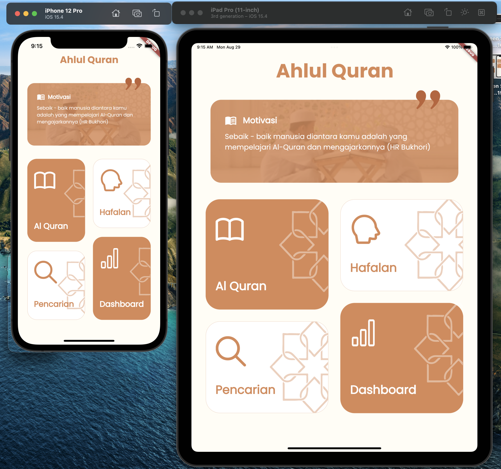

# Flutter Al Quran App

Flutter Tutorial for Design layouting and integration data from API purpose for Reading and Learning Al Quran

# Figma

(Figma Link)(https://www.figma.com/community/file/1101418733985618505) 

# Creator
telegram : 
(Saiful Bahri)[https://t.me/bahri_bhe]

## ScreenShot

| Home           |
|------------------------|
| |

